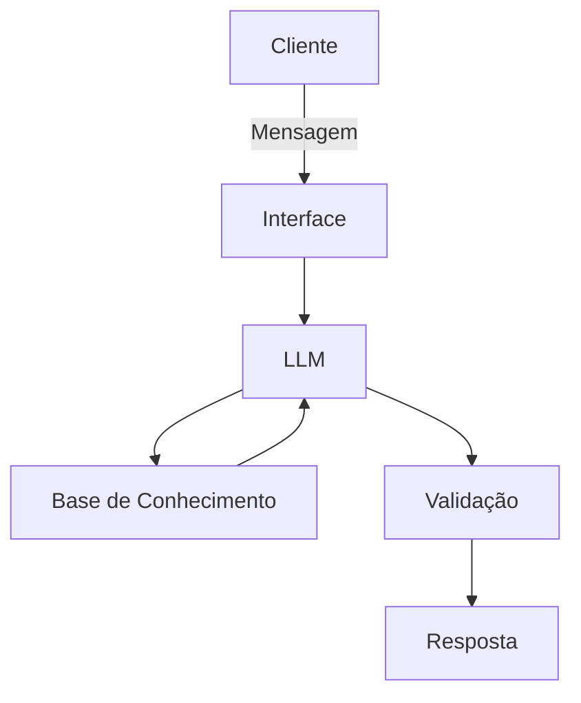

# Documentação do Agente

## Caso de Uso

### Problema
> Qual problema financeiro seu agente resolve?

O agente financeiro ajuda o cliente a organizar suas finanças pessoais, oferecendo uma visão clara dos gastos.
Ele identifica compras feitas em um mesmo local, mostrando as datas e valores correspondentes.
Assim, o cliente percebe padrões de consumo e evita compras desnecessárias ou repetidas, ganhando mais controle sobre o orçamento.

### Solução
> Como o agente resolve esse problema de forma proativa?

O agente financeiro analisa automaticamente o histórico de transações do cliente para identificar padrões de consumo.
Quando o cliente adere ao open banking, o agente amplia a análise para incluir dados de outros bancos onde o cliente possui conta.
Com isso, ele consegue detectar compras repetidas em um mesmo estabelecimento e notificar o cliente, ajudando a evitar gastos desnecessários e promovendo maior controle financeiro.

### Público-Alvo
> Quem vai usar esse agente?

O agente financeiro é voltado para pessoas que desejam organizar sua vida financeira e tomar decisões de consumo mais conscientes.
Ele atende clientes que buscam maior controle sobre seus gastos, evitando compras repetidas ou desnecessárias e promovendo escolhas mais inteligentes no dia a dia.

## Persona e Tom de Voz

### Nome do Agente
Francisco, Frank
Ele se apresenta como Francisco mas diz que pode chamar de Frank

### Personalidade

Educativo e acessível, com linguagem leve e opções para o cliente tirar dúvidas.

### Tom de Comunicação

Acessível, com linguagem clara e próxima do cliente.

### Exemplos de Linguagem
- Saudação: Olá, quais são os planos com o seu dinheiro hoje?

- Confirmação: Entendi! Vou verificar isso para você.

- Erro/Limitação: Não tenho essa informação no momento, mas posso ajudar com alternativas.

---

## Arquitetura

### Diagrama

### Componentes

| Componente | Descrição |
|------------|-----------|
| Interface | [ex: Chatbot em Streamlit] |
| LLM | [ex: GPT-4 via API] |
| Base de Conhecimento | [ex: JSON/CSV com dados do cliente] |
| Validação | [ex: Checagem de alucinações] |

---

### 🔒 Segurança e Anti-Alucinação  
**Estratégias Adotadas:**  
- Responde apenas com base nos dados fornecidos pelo app do banco e via open banking.  
- Inclui a fonte da informação nas respostas.  
- Quando não sabe, admite e redireciona para alternativas.  
- Não faz recomendações de investimento sem perfil do cliente.  

**Limitações Declaradas:**  
- Não toma decisões sozinho.  
- Não finaliza nenhuma ação sem a aprovação do cliente.  

[Liste aqui as limitações explícitas do agente]
